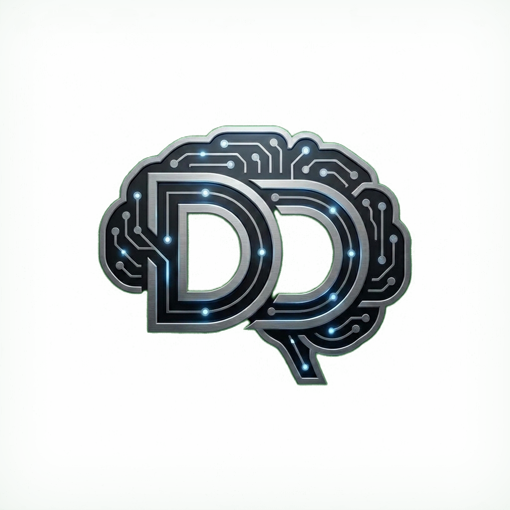

# Sansürsüz Lokal AI Stüdyosu - DD:YZ

<p align="center">
  
</p>

<p align="center">
  <strong>Windows, Linux ve macOS için tamamen taşınabilir (portable), harici kurulum gerektirmeyen ve %100 yerel çalışan yapay zeka stüdyosu: Stable Diffusion (Görsel Üretimi), LLM'ler (Yapay Zeka Sohbeti), Whisper (Sesten Metne) ve Kokoro (Metinden Sese). NVIDIA/AMD/Intel GPU ve Apple Silicon hızlandırmasıyla çalışır.</strong>
</p>

<p align="center">
  
  
  
</p>

<p align="center">
  <a href="https://youtu.be/iykgwvycFio">📺 Kurulum ve Tanıtım Videosunu İzleyin (DD:YZ Kanalı)</a>
</p>

---

## 📑 İçindekiler

* [Sansürsüz Lokal AI Stüdyosu Nedir?](#nedir)
* [Öne Çıkan Özellikler](#ozellikler)
* [Çalışma Alanı ve Motor Mimarisi](#mimari)
* [Desteklenen Modeller](#modeller)
* [Klasör Yapısı](#yapi)
* [Başlarken (Kurulum ve Çalıştırma)](#baslarken)
  * [Windows Kurulumu](#windows-kurulumu)
  * [Linux Kurulumu](#linux-kurulumu)
  * [macOS Kurulumu](#macos-kurulumu)
* [Donanım Uyumluluğu ve Hızlandırma](#donanim)
* [Sorun Giderme ve Sıkça Sorulan Sorular (SSS)](#sss)
* [Kaynaktan Derleme (Geliştiriciler İçin)](#derleme)
* [Lisans](#lisans)
* [Teşekkür ve Atıf](#tesekkur)
* [İletişim ve Topluluk](#iletisim)

---

## <a id="nedir"></a> 💡 Sansürsüz Lokal AI Stüdyosu Nedir?

**Sansürsüz Lokal AI Stüdyosu - DD:YZ**, Windows, Linux ve macOS işletim sistemleri için tamamen çevrimdışı, taşınabilir ve kendi kendine yeten (*self-contained*) hepsi-bir-arada yerel yapay zeka merkezidir. Bulut tabanlı sistemlerin aksine; sansür, içerik filtreleme, veri takibi, abonelik ücreti veya giriş zorunluluğu olmadan tamamen kendi bilgisayarınızın donanımı üzerinde çalışır.

Dört ana yerel yapay zeka kabiliyetini tek bir kullanıcı dostu masaüstü arayüzünde birleştirir:

1. 🎨 **Görsel Üretimi (Stable Diffusion):** `.safetensors`, `.gguf` veya `.ckpt` model ağırlıkları ile çevrimdışı, yüksek kaliteli ve sansürsüz görseller üretin ve düzenleyin.
2. 💬 **Metin Sohbeti (LLM'ler):** Resmi ve yüksek performanslı `llama.cpp` altyapısı sayesinde açık kaynaklı dil modelleriyle (GGUF formatında) tamamen gizli ve sınırsız sohbet edin.
3. 🎙️ **Sesten Metne (Whisper STT):** Entegre `whisper.cpp` motoru ile ses kayıtlarını, mikrofon girdilerini ve konuşmaları anında metne dönüştürün.
4. 🔊 **Metinden Sese (Kokoro TTS):** `Kokoro-82M` ONNX modelini kullanarak yapay zekanın verdiği metin yanıtlarını çevrimdışı olarak insan doğallığında seslendirin.

---

## <a id="ozellikler"></a> ✨ Öne Çıkan Özellikler

* 🔒 **%100 Çevrimdışı ve Gizli:** Tüm yapay zeka çıkarımları (inference) yerel donanımınızda gerçekleşir. İnternet bağlantısı, telemetri, bulut günlüğü veya API anahtarı gerekmez.
* 📦 **Sıfır Kurulum Zahmeti (Taşınabilir):** Node.js, Python veya karmaşık paketleri sisteminize global kurmanıza gerek kalmaz. Proje bağımsız bir klasör olarak yaşar; USB bellekten bile çalıştırılabilir.
* ⚡ **Otomatik Donanım Hızlandırma:** Sistem özelliklerinizi otomatik algılayarak NVIDIA (CUDA), AMD (ROCm / Vulkan), Intel (Vulkan / OpenVINO NPU) veya Apple Silicon (Metal) hızlandırmasını devreye alır.
* 📥 **Entegre Model Yöneticisi:** Hugging Face üzerindeki açık modelleri tek tıkla doğrudan uygulama içinden indirin ve yönetin.
* 📊 **Canlı Performans Monitörü:** CPU, RAM, GPU ve VRAM kullanımını web arayüzünde canlı olarak izleyin.
* 🖼️ **Yerel Çıktı Galerisi:** Üretilen tüm görselleri, prompt (istem) parametrelerini ve JSON meta verilerini otomatik olarak düzenli bir galeride saklar.

---

## <a id="mimari"></a> 🏗️ Çalışma Alanı ve Motor Mimarisi

Sistem RAM'ini veya ekran kartı belleğini (VRAM) gereksiz yere tüketmemek için metin ve görsel motorları varsayılan olarak birbirini dışlayacak şekilde çalışır. Arayüz içinden çalışma alanları arasında tek tıkla geçiş yapabilirsiniz:

* **Görsel Üretimi Çalışma Alanı:** Optimize edilmiş `stable-diffusion.cpp` motorunu kullanır. İndirilen görsel modelleri `app/models/` klasöründe saklanır.
* **Metin Sohbeti Çalışma Alanı:** Taşınabilir `llama.cpp` sunucu motorunu kullanır. Dil modelleri (`.gguf`) `app/llm-models/` klasöründe saklanır.
* **Konuşma Tanıma (Whisper):** Mikrofon veya ses dosyalarını işleyen `whisper.cpp` motorunu kullanır (`app/speech-models/`).
* **Sesli Yanıt (Kokoro TTS):** Metinleri doğal sese dönüştüren `kokoro-js` çalışma zamanını kullanır (`app/tts-models/`).

---

## <a id="modeller"></a> 🧠 Desteklenen Modeller

Uygulama, entegre motorlar tarafından doğrudan yüklenebilen tek dosyalık yerel modeller için optimize edilmiştir.

### Görsel Üretimi Modelleri

| Model Tipi | Destek Durumu | Dosya Konumu | Notlar |
| :--- | :--- | :--- | :--- |
| **Stable Diffusion 1.5 Checkpoint** | ✅ Tam Destek | `app/models/` | En yüksek hız ve uyumluluk. `.safetensors` veya `.ckpt` dosyaları kullanılır. |
| **SDXL Checkpoint** | ✅ Tam Destek | `app/models/` | Yüksek çözünürlük ve kalite. SD 1.5'e göre daha fazla VRAM gerektirir. |
| **Tek Dosyalı SD/SDXL GGUF** | ⚠️ Sınırlı | `app/models/` | Yalnızca bağımsız tek dosya halinde paketlenmiş GGUF checkpoint'ler desteklenir. |
| **OpenVINO Görsel Modelleri** | ⚡ Intel NPU | `app/openvino-models/` | Intel Core Ultra NPU kurulumundan sonra Model Yöneticisi'nden indirilebilir. |
| **CoreML Görsel Modelleri** | 🍎 Apple Silicon | `app/models/` | macOS üzerinde Apple Silicon ve CoreML optimizasyonuyla çalışır. |
| **Çok Dosyalı Flux, Hunyuan, Wan, Z-Image** | ❌ Desteklenmiyor | - | Ayrı difüzyon, VAE ve text-encoder dosyaları gerektiren karmaşık iş akışları doğrudan tek tıkla yüklenemez. |
| **LoRA / ControlNet / Tek Başına VAE** | ❌ Desteklenmiyor | - | Yardımcı bileşenler bağımsız model olarak başlatılamaz. |

#### Model Yöneticisi'nden Önerilen Bazı Görsel Modeller:

| Model Adı | Dosya Adı | Mimari | Boyut | Önerilen Kullanım Alanı |
| :--- | :--- | :--- | :--- | :--- |
| **Juggernaut XL v9 Lightning** | `Juggernaut_RunDiffusionPhoto2_Lightning_4Steps.safetensors` | SDXL | 6.6 GB | Yüksek kaliteli, fotogerçekçi portre ve manzara üretimi (Hızlı 4-8 adım). |
| **DreamShaper XL Lightning** | `DreamShaperXL_Lightning.safetensors` | SDXL | 6.6 GB | İllüstrasyon, dijital sanat, fantezi ve 3D render tarzı çıktılar. |
| **DreamShaper 8** | `DreamShaper_8_pruned.safetensors` | SD 1.5 | 2.1 GB | Hızlı, düşük bellek ve orta/giriş seviye GPU'lar için genel amaçlı üretim. |
| **CyberRealistic V8** | `CyberRealistic_V8_FP16.safetensors` | SD 1.5 | 2.0 GB | Gerçekçi insan ve çevre detayları için hafif SD 1.5 modeli. |
| **Rev Animated** | `rev-animated-v1-2-2.safetensors` | SD 1.5 | 2.0 GB | Anime, stilize çizim ve animasyon tarzı görsel üretimi. |

---

### Metin, Konuşma ve Seslendirme Modelleri

| Çalışma Alanı | Desteklenen Formatlar | Dosya Konumu | Notlar |
| :--- | :--- | :--- | :--- |
| **Metin Sohbeti (LLM)** | `.gguf` (llama.cpp) | `app/llm-models/` | Qwen 2.5, Llama 3, Mistral, Gemma vb. GGUF formatındaki tüm açık dil modelleri. Görsel anlama (Vision) için uyumlu `mmproj` dosyası da eklenebilir. |
| **Sesten Metne (STT)** | whisper.cpp `.bin` | `app/speech-models/` | GGML formatındaki Whisper modelleri (`base`, `small`, `medium` vb.). |
| **Metinden Sese (TTS)** | Kokoro `.json` ve ağırlıklar | `app/tts-models/` | Entegre Kokoro çalışma ortamı ile doğal Türkçe ve çoklu dil desteği. |

---

## <a id="yapi"></a> 📁 Klasör Yapısı

```text
SansursuzLokalAIStudyosu-DDYZ/
├── windows.bat                # Windows Başlatıcı (Çift tıklayarak açın)
├── linux.sh                   # Linux Başlatıcı (Terminal üzerinden çalıştırın)
├── mac.sh                     # macOS Başlatıcı (Terminal üzerinden çalıştırın)
├── LICENSE                    # MIT Açık Kaynak Lisansı
├── README.md                  # Ayrıntılı Türkçe sistem dokümantasyonu
├── scripts/
│   ├── setup/                 # Platforma özel otomatik kurulum betikleri
│   ├── reset/                 # Temiz kurulum ve ortam sıfırlama araçları
│   ├── server/                # Node.js yerel web sunucusu ve süreç yöneticisi
│   └── build/                 # İsteğe bağlı kaynaktan derleme yardımcıları
└── app/
    ├── frontend/              # Web arayüzü kaynak kodları (React + Vite)
    ├── models/                # Görsel modelleri (.safetensors, .ckpt)
    ├── llm-models/            # Dil modelleri (.gguf)
    ├── speech-models/         # Whisper ses modelleri (.bin)
    ├── tts-models/            # Kokoro seslendirme modelleri
    └── outputs/               # Üretilen görseller ve parametre kayıtları
```

---

## <a id="baslarken"></a> 🚀 Başlarken (Kurulum ve Çalıştırma)

Bilgisayarınızda modern bir internet tarayıcısının (Chrome, Edge, Brave, Firefox vb.) kurulu olduğundan emin olun. İşletim sisteminize uygun adımları takip edin:

### 🪟 Windows Kurulumu

1. **Başlatın:** `windows.bat` dosyasına çift tıklayın.
   > *İlk çalıştırmada betik, taşınabilir Node.js ortamını ve sisteminize uygun GPU/CPU motorlarını otomatik olarak indirecek ve yapılandıracaktır.*
2. **Model Ekleyin:** İndirdiğiniz modelleri ilgili klasörlere bırakın veya doğrudan arayüzdeki **Model Yöneticisi** sekmesinden tek tıkla indirin.
3. **Kullanmaya Başlayın:** Tarayıcınızda otomatik olarak `http://localhost:1420` adresi açılacaktır.

---

### 🐧 Linux Kurulumu

#### 1. Standart Terminal Kurulumu ve Başlatma
Ubuntu, Debian, Fedora, Arch, Linux Mint gibi dağıtımlarda terminalden kurulum yapmak için:

1. **Depoyu İndirin (Clone):**
   ```bash
   git clone https://github.com/DDYapayZeka/SansursuzLokalAIStudyosu-DDYZ.git
   cd SansursuzLokalAIStudyosu-DDYZ
   ```

2. **Çalıştırma İzni Verin:**
   ```bash
   chmod +x linux.sh scripts/setup/*.sh
   ```

3. **Uygulamayı Başlatın:**
   ```bash
   ./linux.sh
   ```
   > [!NOTE]
   > **İlk Çalıştırma:** Betik, taşınabilir Linux Node.js ortamını ve GPU/CPU motorlarını `app/` klasörü altına otomatik kurar ve tarayıcınızı açar.
   > - **NVIDIA Kullanıcıları:** CUDA hızlandırması otomatik algılanır veya kurulur.
   > - **AMD Radeon GPU:** ROCm desteği eklemek için `./linux.sh --max-perf` ile çalıştırabilirsiniz.
   > - **Intel Core Ultra NPU:** OpenVINO NPU desteği için `./linux.sh --setup-openvino` kullanabilirsiniz.

4. **Model Yükleyin:** Arayüzdeki **Model Yöneticisi** sekmesinden tek tıkla model indirebilir veya kendi modellerinizi `app/models/` ya da `app/llm-models/` klasörlerine taşıyabilirsiniz.

#### 2. USB Belleğe / Harici Diske Kurulum (Taşınabilir Kullanım)
Projemiz **%100 bağımsız (self-contained)** mimaridedir; işletim sisteminize global hiçbir paket yüklemez. Tüm motorlar, ayarlar ve indirilen modeller projenin kendi klasörü (`app/`) içinde saklanır. Bu sayede stüdyoyu doğrudan bir USB bellek veya harici SSD üzerinden tak-çalıştır şeklinde kullanabilirsiniz.

* **⚠️ USB Dosya Sistemi Formatı (Önemli):**
  * **FAT32 Kullanmayın:** FAT32 formatı tek parça **4 GB'tan büyük** dosyaları desteklemez. Yapay zeka modelleri genellikle 4-8 GB+ boyutunda olduğu için indirme yarım kalır.
  * **Önerilen Formatlar:** Hem Windows hem Linux'ta ortak kullanmak için **exFAT** veya **NTFS**, yalnızca Linux'ta kullanacaksanız **ext4** formatı önerilir (USB 3.0+ veya harici SSD tavsiye edilir).

* **USB Üzerinden Adım Adım Çalıştırma:**
  1. USB belleğinizi takın ve terminalden USB dizinine geçin:
     ```bash
     cd /media/$USER/USB_DISKINIZIN_ADI/
     ```
  2. Projeyi doğrudan USB içine klonlayın:
     ```bash
     git clone https://github.com/DDYapayZeka/SansursuzLokalAIStudyosu-DDYZ.git
     cd SansursuzLokalAIStudyosu-DDYZ
     ```
  3. Başlatın:
     ```bash
     bash linux.sh
     ```
     > [!TIP]
     > **İzin Hatası Alırsanız:** Bazı Linux dağıtımları harici USB diskleri güvenlik amacıyla `noexec` (çalıştırma kısıtlaması) bayrağıyla bağlar. Eğer `./linux.sh` izni reddedilirse, doğrudan `bash linux.sh` komutu ile başlatabilirsiniz.

---

### 🍏 macOS Kurulumu

1. **Çalıştırma İzni Verin:** Terminali açın ve proje klasöründe betiğe yetki verin:
   ```bash
   chmod +x mac.sh
   ```
2. **Başlatın:**
   ```bash
   ./mac.sh
   ```
   > Önceden derlenmiş macOS motoru **Apple Silicon (M1, M2, M3, M4 veya daha yeni)** işlemciler için optimize edilmiştir ve **Metal** GPU hızlandırmasını kullanır.
3. **Kullanmaya Başlayın:** Tarayıcınızda `http://localhost:1420` adresini açın.

---

## <a id="donanim"></a> 🖥️ Donanım Uyumluluğu ve Hızlandırma

### Windows Donanım Desteği

| Ekran Kartı / Donanım | Kullanılan Teknoloji | Hızlandırma Durumu | Notlar |
| :--- | :--- | :--- | :--- |
| **NVIDIA RTX / GTX** | CUDA | 🟢 Yerel Donanım | CUDA 12 optimizasyonları ile en yüksek performans (`sd-cuda.exe`). |
| **AMD Radeon** | Vulkan | 🟢 Yerel Donanım | Vulkan API hızlandırması ile yüksek performans (`sd-vulkan.exe`). |
| **Intel Arc / Iris Xe** | Vulkan | 🟢 Yerel Donanım | Intel GPU'lar için Vulkan hızlandırması kullanılır. |
| **Dahili Grafik / Sadece CPU** | CPU | 🟡 İşlemci Modu | Donanım hızlandırma olmadan CPU çekirdekleri üzerinde çalışır (daha yavaş). |

### Linux Donanım Desteği

| Ekran Kartı / Donanım | Birincil Motor | Yedek Motor | Notlar |
| :--- | :--- | :--- | :--- |
| **NVIDIA** | CUDA / Vulkan | Vulkan / CPU | NVIDIA kartları otomatik algılanır. CUDA hazır ikiliyi kurar veya kaynaktan derler. |
| **AMD Radeon** | ROCm | Vulkan | ROCm sürücüleri kuruluysa en yüksek AMD performansını sunar. |
| **Intel Arc / Entegre** | Vulkan | CPU | Çoklu üretici Vulkan API desteği. |
| **Intel Core Ultra NPU** | OpenVINO NPU | CPU | Intel Linux NPU sürücüsü, kernel 6.6+ ve `./linux.sh --setup-openvino` gerektirir. |
| **Sadece CPU** | CPU | - | Tüm sistemlerde işlemci üzerinde çalışır. |

### macOS Donanım Desteği

| Donanım Mimarisi | Birincil Hızlandırma | Notlar |
| :--- | :--- | :--- |
| **Apple Silicon (M1 - M4)** | Metal GPU / Neural Engine | Resmi ARM64 motoru ile mükemmel bellek ve GPU verimliliği. |

---

## <a id="sss"></a> ❓ Sorun Giderme ve Sıkça Sorulan Sorular

* **Ortamı Sıfırlama ve Onarma:**  
  Herhangi bir bileşen eksik inerse veya ortamı temizlemek isterseniz `scripts/reset/reset.ps1` (Windows) veya `scripts/reset/reset.sh` (Linux/macOS) çalıştırabilirsiniz. Bu işlem modellerinizi veya çıktı görsellerinizi **silmez**, sadece motorları ve önbelleği yeniler.

* **Linux `GLIBC_2.38 not found` Hatası:**  
  Önceden derlenmiş Linux motorları modern `glibc 2.38+` kütüphanelerini (Ubuntu 24.04, Fedora 40+, Mint 22 vb.) gerektirir. Daha eski bir dağıtım kullanıyorsanız işletim sisteminizi güncelleyebilir veya motorları kaynaktan derleyebilirsiniz.

* **Port Çakışması (Port Meşgul Uyarısı):**  
  Web arayüzü varsayılan olarak `1420` portunda çalışır. Eğer bu port doluysa sistem otomatik olarak bir sonraki boş portu bularak arayüzü başlatır.

* **Linux'ta Çift GPU / Dahili Ekran Kartı Seçimi:**  
  Çift ekran kartlı Linux laptoplarda Vulkan motorunun harici kartı kullanmasını zorlamak için uygulamayı şu şekilde başlatabilirsiniz:  
  `SD_VULKAN_DEVICE=vulkan1 ./linux.sh`

* **Windows `0xC0000135` (Eksik DLL) Hatası:**  
  Sisteminizde gerekli ekran kartı sürücüsünün veya Vulkan/CUDA çalışma zamanının eksik olduğunu gösterir. Grafik sürücünüzü (NVIDIA Game Ready / AMD Adrenalin) güncelleyin.

---

## <a id="derleme"></a> 🛠️ Kaynaktan Derleme (İleri Düzey)

Eski bir Linux dağıtımında veya özel bir donanım üzerinde çalışıyorsanız, arka uç motorlarını kendi sisteminizde sıfırdan derleyebilirsiniz:

### Gereksinimler
* `git`, `cmake`, `make` (veya `ninja`) ve modern bir C++17 derleyici (`g++` / `clang++`).
* **CUDA İçin:** NVIDIA CUDA Toolkit (`nvcc`).
* **Vulkan İçin:** Vulkan SDK ve `glslc` paketi.

### Derleme Adımları:
```bash
# 1. Kaynak depoyu klonlayın
git clone https://github.com/leejet/stable-diffusion.cpp.git
cd stable-diffusion.cpp
mkdir build && cd build

# 2. Donanımınıza uygun şekilde yapılandırın (Birini seçin):
# CUDA (NVIDIA):
cmake .. -DSD_CUDA=ON -DSD_BUILD_SHARED_LIBS=ON -DCMAKE_BUILD_TYPE=Release

# Vulkan (AMD / Intel):
cmake .. -DSD_VULKAN=ON -DSD_BUILD_SHARED_LIBS=ON -DCMAKE_BUILD_TYPE=Release

# macOS Metal:
cmake .. -DSD_METAL=ON -DSD_BUILD_SHARED_LIBS=ON -DCMAKE_BUILD_TYPE=Release

# 3. Derlemeyi başlatın
cmake --build . --config Release -j$(nproc 2>/dev/null || sysctl -n hw.ncpu)

# 4. Çıkan ikilileri projenin ilgili klasörüne kopyalayın
cp bin/sd* /yol/SansursuzLokalAIStudyosu-DDYZ/app/backend/linux/vulkan/sd-vulkan
```

---

## <a id="lisans"></a> 📜 Lisans

Bu proje **[MIT Lisansı](LICENSE)** ile lisanslanmıştır. Projede kullanılan `stable-diffusion.cpp` ve `llama.cpp` projeleri kendi açık kaynak lisanslarına (MIT) sahiptir. İndirdiğiniz yapay zeka modelleri ise ilgili modellerin kendi açık kaynak kullanım koşullarına tabidir.

---

## <a id="tesekkur"></a> 🤝 Teşekkür ve Atıf

Bu proje, [techjarves](https://github.com/techjarves) tarafından geliştirilen özgün **[Uncensored-Local-Studio](https://github.com/techjarves/Uncensored-Local-Studio)** projesi temel alınarak yeniden yapılandırılmış (refactored), Türkçeleştirilmiş ve yeni özelliklerle zenginleştirilmiş bir sürümdür. Açık kaynak dünyasına sağladığı değerli katkılardan dolayı **techjarves**'e teşekkür ederiz.

* **Özgün Proje:** [techjarves/Uncensored-Local-Studio](https://github.com/techjarves/Uncensored-Local-Studio)
* **Bu Sürüm:** Türkçe arayüz yerelleştirmesi, model indirme optimizasyonları, tek tıkla model yönetim iyileştirmeleri ve ek platform desteklerini içerir.

---

## <a id="iletisim"></a> 📢 İletişim ve Topluluk

* 📺 **YouTube Kanalımız:** [Derine Dalıyoruz: Yapay Zeka (DD:YZ)](https://www.youtube.com/@derinedaliyoruzyapayzeka)
* 📧 **E-posta İletişim:** [divingdeep.ai.tr@gmail.com](mailto:divingdeep.ai.tr@gmail.com)

Projeyi beğendiyseniz GitHub üzerinde **⭐ Yıldız (Star)** vererek ve YouTube kanalımıza abone olarak destek olabilirsiniz!
